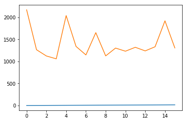
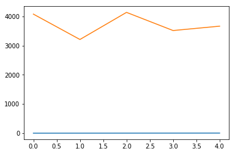

### Computer configuration
2 real cores, 2 virtual cores, hyper threading is on, 


```python
from matplotlib import pyplot as plt
```

Lets parse time results for different values of thread numbers and cores in use


```python
times_t = open("times.txt", "r").read().split('\n')[:-1]
averages = {}
averages_acceleration = {}
t_count_last = 0
average = 0
counter = 0

for i, x in enumerate(times_t):
    t_count = int(x.split(',')[1])
    if t_count_last == 0:
        t_count_last = t_count
    if t_count != t_count_last:
        averages[str(t_count_last)] = average / counter
        average = 0
        counter = 0
        t_count_last = t_count
    average += int(x.split(',')[0])
    counter += 1
    
    # 5 and 6 are magic numbers - number of tests. Must be removed
    if str((i+1)%6) not in averages_acceleration:
        averages_acceleration[str((i+1)%6)] = 0
    averages_acceleration[str((i+1)%6)] += int(x.split(',')[0]) / 5
# Last
averages[str(t_count_last)] = average / counter
print(averages)
```

    {'5': 2037.6, '12': 1319.6, '10': 1301.8, '11': 1230.8, '8': 1651.2, '16': 1305.0, '13': 1237.6, '14': 1331.4, '2': 1264.2, '9': 1124.6, '15': 1919.0, '4': 1058.0, '7': 1146.4, '6': 1339.2, '3': 1122.8, '1': 2168.6}


#### Drawing average time (ms) for different thread and core counts 


```python
dots = []
for i in range(1, 100):
    if str(i) in averages:
        dots.append([i, averages[str(i)]])

fig = plt.figure()
plt.plot(dots)
```


    [<matplotlib.lines.Line2D at 0x7fa6aa76b748>,
     <matplotlib.lines.Line2D at 0x7fa6aa76ba58>]





Here we can see that parallelism is workking fine. Minimum time is at 4 cores and threads and the biggest time for the 1 core and thread (and for 4 cores and more than 15 threads). Threads here are goroutines

#### Now drawing average time for every 'unique' task number - thread pool accelaration


```python
dots = []
for i in range(1, 100):
    if str(i) in averages_acceleration:
        dots.append([i, averages_acceleration[str(i)]])

fig = plt.figure()
plt.plot(dots)
```


    [<matplotlib.lines.Line2D at 0x7fa6aa4af080>,
     <matplotlib.lines.Line2D at 0x7fa6aa4af390>]





Here we can see that thread pool with goroutines and barrier is  bad idea - **no acceleraion**


```python

```
